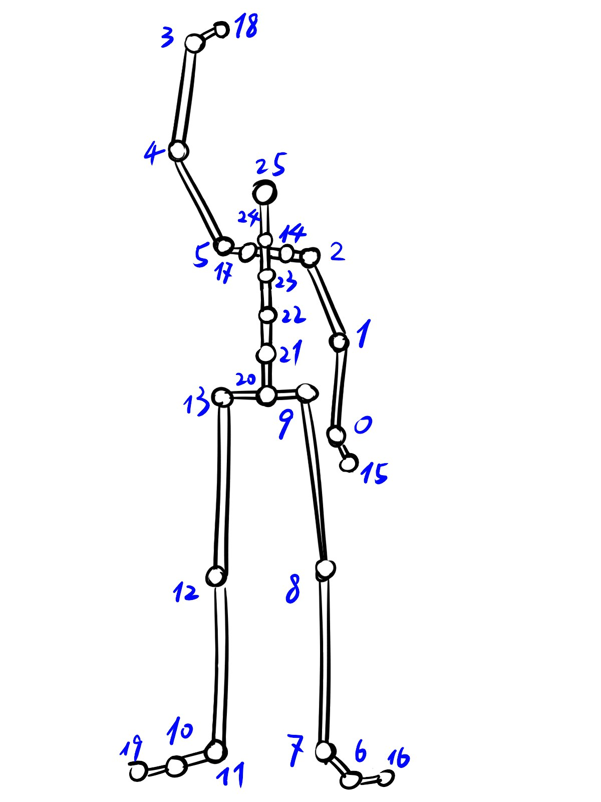

# Classification of Human Body Activities

#### -- Project Status: [Active]

## Project Introduction

The purpose of this project is to classify human body activity with machine learning methods based on joint coordinates from [Captury Live](https://captury.com/captury-live/).
This thesis theme is offered by M.Sc Apostolos Vrontos from [Institute of Industrial Enginering and Ergonomics (IAW)](https://www.iaw.rwth-aachen.de/go/id/ieplw/?lidx=1) at [RWTH Aachen University](https://www.rwth-aachen.de/go/id/a/?lidx=1), and the codes are created by Jialei Li, from major [Robotic System Engineering](https://www.academy.rwth-aachen.de/en/programs/masters-degree-programs/detail/msc-robotic-systems-engineering), RWTH Aachen University.

### Methods Used

* Spacial coordinates of body joints
* Feature selection
* Statistic
* Data Visualization
* Machine Learning
* Classification Modelling

### Technologies

* Python
* Pandas
* Matplotlib
* scikit-learn

## Project Description

Human body activities can be classified based on data of joints or limbs. For example, firstly choose some critical joints which can generally and specifically define an activity (e.g. wrist, elbow, ankle, knee). Then being aware of the spacial coordinates of these joints can give a general picture of what the current activity is, which is also the basis for classification.

We deploy the software and equippment from Captury Live, whose GUI directly output spacial coordinates of all pre-defined joints, to create raw dataset for training our machine learning model to classify.

We preprocessed raw data from .csv file from Captury Live, including:

* visualize coordinates
* select joints
* calculate kinematic features
* windowlize frames (for classification of dynamic activities)
* calculate statistic featues

After the operation of preprocessing mentioned above, we split dataset into **trainset** and **testset** for model. Note that **testset** can also be provided with extra dataset instead of extracting from original dataset, which will be covered later.


## Getting Started

### 1) Configure env

Firstly create a new env and install all necessary dependencies. If you are using **Anaconda** on **Linux**, you can directly run the following commands in terminal:

```
conda create --name MotionClass python
pip install numpy
pip install pandas
pip install -U matplotlib
pip install -U scikit-learn
```

### 2) Create dataset

Follow the steps to prepare and examine data for creating dataset.

#### Step1: Generate exp_group

**exp_group** is the folder containing trainset and testset data of one single user, whose name follow the naming-style **Dynamic/Static_username**, and whose folder structure is like the following example:

```
└── datasets/
    └── Dynamic_user1/
        ├── testset/
        |   └── Test_Dynamic_user1/
        |       ├── split_method.yaml
        |       └── unknown.NoHead.csv
        └── trainset/
            ├── Train_Dynamic_user1_00_act1/
            |   ├── split_method.yaml
            |   └── unknown.NoHead.csv
            ├── Train_Dynamic_user1_01_act2/
            |   ├── split_method.yaml
            |   └── unknown.NoHead.csv
            └── Train_Dynamic_user1_02_act3/
                ├── split_method.yaml
                └── unknown.NoHead.csv
```

The above exp_group **Dynamic_user1** defines 3 classes of activities. Due to recording methods, shot of each class of activity in **trainset** are saved separately, while **testset** not. Please refer to report for details.

In order to generate a exp_group:

1. Create a new ```/config/class_ExpName.yaml``` according to example ```/config/class_Morning.yaml```
2. Edit arguments in ```generate_split_methods_trainset.py``` according to tips inside
3. Run with: ```python generate_split_methods_trainset.py```


#### Step2: Cut .csv file

The form of initial csv files output from Captury Live have problem to be converted into ```numpy.array```. Hence, some of lines need to be cut off.
Move the ```unknown.csv``` under same path with ```cut_csv.py```, run ```cut_csv.py``` with:

```
python cut_csv.py
```

Then a ```unknown.NoHead.csv``` will be generated under same path. And paste the ```unknown.NoHead.csv``` under corresponding location in **exp_group**

#### Step3: Check data by plotting

Check the Original Data $Arr_{ori}$ from ```unknown.NoHead.csv``` from **Step2** with function **check_ori_data**, by editing the arguments according to instruction in ```data_visualization.py``` and running it with:

```
python data_visualization.py
```

#### Step4: Edit ```split_methods.yaml``` for testset

Note that due to recording methods, **trainset** consists of shots with same frames, each of shot contains only one activity, hence the ```split_methods.yaml``` can be generated automatically by ```generate_split_methods_trainset.py```. While **testset** consists of only one shot with all activities for testing, the concrete ```split_methods.yaml``` need to be manully edited with help of function **check_ori_data** in ```data_visualization.py```.

Refer to **Step3** for how to use ```data_visualization.py```.

Refer to example below to manully edit ```split_methods.yaml``` for testset(number after activity name indicates how many same activities appear in current shot, e.g. None1, None2):

```
None1:            # None class is for unexplicit or transitional movement between defined classes
  start: 0        # starts from the "end" of previous class
  end: 220        # ends from the "start" of next class
  label: 0        # label as 0
Boxing1:          # Name = Abbreviation(from above) + x-th segment with same activity
  start: 220      # start: from which frame belong to this segment of activity
  end: 480        # end: to which frame belong to this segment of activity
  label: 7        # label: customized label of this activity
None2:
  start: 480
  end: 680
  label: 0
Boxing2:
  start: 680
  end: 860
  label: 7
```

#### Step5: Edit desired_features.yaml

Edit ```config/desired_features.yaml``` to determine which features which you want to add into your final dataset to train. E.g.:

```
desired_dists:
  - LHandEnd_head
  - LWrist_head
  - LElbow_head
desired_angles:
  - LHandEnd_LWrist_LElbow
  - LWrist_LElbow_LShoulder
```

The rule of defining feature's name is as following:

* distance features: joint1_joint2
* angle features: joint1_joint2_joint3 (joint2 is vertex of the angle)

All joints' names to be selected and corresponding index is shown below:

| Index | Abbreviation | Joint |
|--|--|--|
|0| LWrist | left wrist |
|1| LElbow | left elbow |
|2| LShoulder | left shoulder |
|3| RWrist | right wrist |
|4| RElbow | right elbow |
|5| RShoulder | right shoulder |
|6| LToe | left toe |
|7| LAnkle | left ankle |
|8| LKnee | left knee |
|9| LHip | left hip |
|10| RToe | right toe |
|11| RAnkle | right ankle |
|12| RKnee | right knee |
|13| RHip | right hip |
|14| LClavicle | left clavicle |
|15| LHandEnd | end of left hand |
|16| LToesEnd | end of left toe |
|17| RClavicle | right clavicle |
|18| RHandEnd | end of right hand |
|19| RToesEnd | end of right toe |
|20| spine1 | spinal joint between left hip and right hip |
|21| spine2 | 2nd spinal joint from spine1 |
|22| spine3 | 3rd spinal joint from spine1 |
|23| spine4 | 4th spinal joint from spine1 |
|24| spine5 | 5th spinal joint from spine1 |
|25| head | head vertex |



Refer to report for more details.

#### Step6: Verify features

Use function **verify_before_output** in ```data_visualization.py``` to check whether there are errors in calcualtion of Frame Feature Array $Arr_{ff}$. Refer to **Step3** for how to use ```data_visualization.py```.

### 3) Plot meta-feature

To get a intuition of periodical behavior of window Window Feature Array $Arr_{wf}$, run ```plot_features.ipynb``` to visualize meta-features. Refer to ```plot_features.ipynb``` for usage. Refer to report for details about **windowlization** and **calculation of meta-features**.

### 4) Train & Test

#### 1. Train model

Edit arguments in ```train.py``` according to instructions inside. And run by:

```
python train.py
```

Note that

1. **Cross Test** means that train on trainset of train_exp_group, i.e. from user1, and test on testset of test_exp_group, i.e. from user2.
1. **NonCross Test** means that train and test on same exp_group, i.e. current train_exp_group from one user

#### 2. Outputs

Every time ```train.py``` is successfully run, a folder with outputs is generated. In the folder, there are 4 forms of results or outputs:

1. PNG picture:         performance of accuracy of testing, both classification result and truth
2. arg.yaml:            configuration of current experiment, for extra testing in ```test.py``` and loading later, if necessary
3. miscls_index.txt:    index of misclassified windows, indices of frames making up these windows
4. model.pickle:        trained model in current experiment, for extra testing in ```test.py``` and loading later, if necessary

#### 3. Extra testing

You can define which trainset and which testset to train and test, but you can also load a trained model output from ```train.py``` and designate a new testset to test it with ```test.py```. Refer to instructions inside ```test.py``` for usage.

### 5) Post processing

Get frames of misclassified windows in ```miscls.txt```, and visualize corresponding windows ```data_visualization.py```, under function **post_process**. Refer to **2) Step3** for usage.

## Contact

The members in this project:

|Name |
|--|
|Jialei Li |
|Apostolos Vrontos |

* If you need more details of codes, please contact Email of [Jialei Li](mailto:jia.lei.li@rwth-aachen.de);
* If you need to know background or further application development of this project, please contact Email of [Apostolos Vrontos](mailto:a.vrontos@iaw.rwth-aachen.de)
