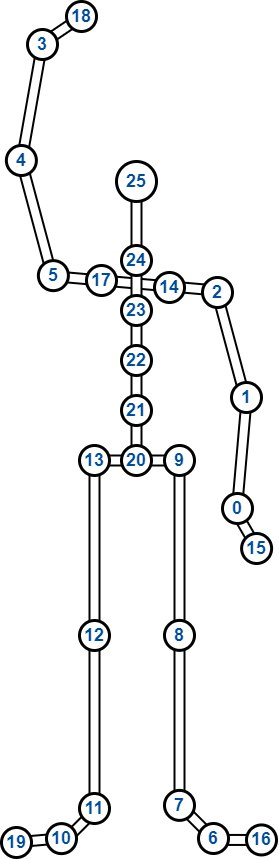

# Classification of Human Body Activities

#### -- Project Status: [Active]

## Project Introduction

The purpose of this project is to classify human body activity with machine learning methods based on joint coordinates from [Captury Live](https://captury.com/captury-live/).
This thesis theme is offered by M.Sc Apostolos Vrontos from [Institute of Industrial Enginering and Ergonomics (IAW)](https://www.iaw.rwth-aachen.de/go/id/ieplw/?lidx=1) at [RWTH Aachen University](https://www.rwth-aachen.de/go/id/a/?lidx=1), and the codes are created by Jialei Li, from major [Robotic System Engineering](https://www.academy.rwth-aachen.de/en/programs/masters-degree-programs/detail/msc-robotic-systems-engineering), RWTH Aachen University.

### Methods Used

* Spacial coordinates of body joints
* Feature selection
* Statistic
* Data Visualization
* Machine Learning
* Classification Modelling

### Technologies

* Python
* Pandas
* Matplotlib
* scikit-learn
* jupyter

## Project Description

Human body activities can be classified based on data of joints or limbs. For example, firstly choose some critical joints which can generally and specifically define an activity (e.g. wrist, elbow, ankle, knee). Then being aware of the spacial coordinates of these joints can give a general picture of what the current activity is, which is also the basis for classification.

We deploy the software and equippment from Captury Live, whose GUI directly output spacial coordinates of all pre-defined joints, to create raw dataset for training our machine learning model to classify.

We preprocessed raw data from .csv file from Captury Live, including:

* visualize coordinates
* select joints
* calculate kinematic features
* windowlize frames (for classification of dynamic activities)
* calculate statistic featues

After the operation of preprocessing mentioned above, we split dataset into **trainset** and **testset** for model. Note that **testset** can also be provided with extra dataset instead of extracting from original dataset, which will be covered later.


## Getting Started

### 1) Prepare

Firstly create a new env and install all necessary dependencies. If you are using **Anaconda** on **Linux**, you can directly run the following commands in terminal:

```
conda create --name MotionClass python
pip install numpy
pip install pandas
pip install -U matplotlib
pip install -U scikit-learn
```

And the whole directory structure is shown as follows.

```
└── root/
    ├── data_visualization.py
    ├── dataset_generation.py
    ├── train_dynamic_ML.py
    ├── train_static_ML.py
    ├── plot_features.ipynb
    ├── README.md
    ├── Archiv/
    ├── bash/
    |   ├── exp_agree.sh
    |   └── exp_dynamic.sh
    ├── dataloader/
    |   └── ML_dataloader.py
    ├── datasets/
    |   ├── desired_features_trial.yaml
    |   ├── desired_features.yaml
    |   └── raw_data_1/
    |       ├── split_method.yaml
    |       ├── unknown.NoHead.csv
    |       ├── x_data_UpperLowerBody.npy
    |       └── y_data_UpperLowerBody.npy
    ├── model/
    |   ├── dynamic_models.py
    |   └── static_models.py
    ├── result/
    |   ├── result1.png
    |   └── result2.png
    └── util/
        ├── features.py
        ├── plots.py
        └── utils.py
```

### 2) Generate dataset

The dataset can be customized based on raw data from .csv from Captury Live. Feel free to research on which **features** to select for dataset, which is directly used to train model.

#### Step1: Edit .csv

**Important!!!**

Due to version issue of Captury Live software on Ubuntu18, the .csv output has problems to number of columns in head-part, i.e. number of columns of these items differ from each other:

* 1st row: recording information
* 2nd row: number of frames
* 3rd row: names of coordinates / joints
* 4th row: coordinates signs
* 5th row: unit of coordinates
* last rows: camera calibration configuration

As a reusult, it is difficult to directly extract data from raw .csv with Pandas, which needs manual editing. Please follow the steps below:

* 1. manually delete first 5 rows and last rows of camera calibration configuration
* 2. rename .csv as ```unknown.NoHead.csv```
* 3. move ```unknown.NoHead.csv``` under path ```/dataset/name_of_your_raw_data/```

#### Step2: Check data by plotting

Run this script in terminal under **root path**, to plot the segment with default arguments:

```
python data_visualization.py --function "check_ori_data" --single_data_path "dataset/testset_20230627" --start_frame 0 --end_frame 200
```

Also, you can edit the arguments which you want to check:

| args | Type | Description |
|--|--|--|
| --single_data_path | str | edit to the path where your ```unknown.NoHead.csv``` is located |
| --start_frame | int | from which frame to plot |
| --end_frame | int | to which frame to plot |
| --output_anim | bool | set it as True if you want to output the animation of selected segments (defaultly set as False) |

#### Step3: Create split_method.yaml

Oringinal data only have coordinates of joints, without label. Manually labelling should be done in this step. The examples below is for the prepared dataset, you can always customized your own:

1. Static Activity

| label | Abbreviation | Description |
|-------|--------------|-------------|
|1| HandNear | hold hands near body |
|2| HandAway | hold hands away from body |
|3| HandOverHead | hands over head |
|4| PhoneLH | hold phone with left hand |
|5| PhoneRH | hold phone with right hand |
    
2. Dynamic Activity

| label | Abbreviation | Description |
|-------|--------------|-------------|
|1| Walking | Walking |
|2| Jumping | Jumping |
|3| Squating | Squating |
|4| Waving | Waving |
|5| Reaching | Reaching out for a cup |
|6| Drinking | Drinking from a cup |
|7| Boxing | Reaching out left and right arms alternatively |
|8| Bicep | Bicep curl |
|9| JumpJack | Jumping jack |

According the examples above, you need to customized your own ```split_method.yaml```, which is vital when split orginal data and labelling. Check this example from one ```split_method.yaml```:

```
None1:            # None class is for unexplicit or transitional movement between defined classes
  start: 0        # starts from the "end" of previous class
  end: 220        # ends from the "start" of next class
  label: 0        # label as 0
Boxing1:          # Name = Abbreviation(from above) + x-th segment with same activity
  start: 220      # start: from which frame belong to this segment of activity
  end: 480        # end: to which frame belong to this segment of activity
  label: 7        # label: customized label of this activity
None2:
  start: 480
  end: 680
  label: 0
Boxing2:
  start: 680
  end: 860
  label: 7
None3:
  start: 860
  end: 1770
  label: 0
Bicep1:
  start: 1770
  end: 2160
  label: 8
```

In order to obtain the value of **start** and **end** of each segment, you have to repeat **Step2: Check data by plotting** manually to define them.


#### Step4: Edit desired_features.yaml

Following the example inside ```dataset/desired_features.yaml```, you can customize which features which you want to add into your final dataset to train.

```
desired_dists:
  - LHandEnd_head
  - LWrist_head
  - LElbow_head
desired_angles:
  - LHandEnd_LWrist_LElbow
  - LWrist_LElbow_LShoulder
```

All joints to be selected and corresponding index is shown below:

| Index | Abbreviation | Joint |
|--|--|--|
|0| LWrist | left wrist |
|1| LElbow | left elbow |
|2| LShoulder | left shoulder |
|3| RWrist | right wrist |
|4| RElbow | right elbow |
|5| RShoulder | right shoulder |
|6| LToe | left toe |
|7| LAnkle | left ankle |
|8| LKnee | left knee |
|9| LHip | left hip |
|10| RToe | right toe |
|11| RAnkle | right ankle |
|12| RKnee | right knee |
|13| RHip | right hip |
|14| LClavicle | left clavicle |
|15| LHandEnd | end of left hand |
|16| LToesEnd | end of left toe |
|17| RClavicle | right clavicle |
|18| RHandEnd | end of right hand |
|19| RToesEnd | end of right toe |
|20| spine1 | spinal joint between left hip and right hip |
|21| spine2 | 2nd spinal joint from spine1 |
|22| spine3 | 3rd spinal joint from spine1 |
|23| spine4 | 4th spinal joint from spine1 |
|24| spine5 | 5th spinal joint from spine1 |
|25| head | head vertex |



The rule of defining feature's name is as following:

* distance features: joint1_joint2
* angle features: joint1_joint2_joint3 (joint2 is vertex of the angle)

#### Step5: Verify features

Use features definded in ```dataset/desired_features_trial.yaml``` to verify whether calculation of features are correct by plotting, and check the fft of randomly selected windows, with command:

```
python data_visualization.py --function "verify_before_output" --single_data_path "dataset/testset_20230627" --wl 51
```

Also, you can edit the arguments which you want to check:

| args | Type | Description |
|--|--|--|
| --single_data_path | str | edit to the path where your ```unknown.NoHead.csv``` is located |
| --wl | int | the window size for one window, please make it as odd number |

You can see corresponding message if there are incorrect calculation. But usually it shows difference as long as there are error within 10e-5, which is totally bearable for most of the cases.

#### Step6: Generate dataset

Firstly there is difference in static datset and dynamic dataset:

| Dataset Type | Description | Example |
|--|--|--|
| static | classification can implement with only one frame | HandNear in Step3: Create split_method.yaml - 1. Static Activity |
| dynamic | classification need several sequential frames, i.e. window | Walking in Step3: Create split_method.yaml - 2. Dynamic Activity |

Then Use features definded in ```dataset/desired_features.yaml``` (please follow **Step4: Edit desired_features.yaml** to define which features are to output for training) to generate dataset:

for static dataset:

```
python dataset_generation.py --type "static" --static_data_path "dataset/testset_20230627" --static_output_path "dataset/testset_20230627"
```

Also, you can edit the arguments which you want to check:

| args | Type | Description |
|--|--|--|
| --static_data_path | str | strings of paths with the original data you want to generate dataset, can contain only one or several paths |
| --static_output_path | str | output path |

for dynamic dataset:

```
python dataset_generation.py --type "dynamic" --dynamic_data_path "dataset/dynamic1_20230706" "dataset/dynamic2_20230706" "dataset/dynamic3_20230706" --dynamic_output_path "dataset/dynamic_dataset"
```
Also, you can edit the arguments which you want to check:

| args | Type | Description |
|--|--|--|
| --dynamic_data_path | str |  strings of paths with the original data you want to generate dataset, can contain only one or several paths |
| --dynamic_output_path | str | output path |

#### Step7: Verify dataset

After generating dataset, you can still verify it to check if calculation has problems, and check the fft of randomly selected windows, just like **Step5: Verify features**.

Example for static data connected by one single .csv

```
python data_visualization.py --function "verify_npy" --source_data_path "dataset/testset_20230627" --npy_root "dataset/testset_20230627"
```

Example for dynamic data connected by multiple .csv

```
python data_visualization.py --function "verify_npy" --source_data_path "dataset/dynamic1_20230706" "dataset/dynamic2_20230706" "dataset/dynamic3_20230706" --npy_root "dataset/dynamic_dataset"
```

Also, you can edit the arguments which you want to check:

| args | Type | Description |
|--|--|--|
| --source_data_path | str | strings of paths with the original data you want to generate dataset, can contain only one or several paths |
| --npy_root | str | where your generated dataset is located |

### 3) Windows

#### Shape of data

The generated dataset has shape: **[num_frames,num_features]**, where:

```
num_frames:     the number of frames in current dataset
num_features:   the number of features of each frame, i.e. num_dist + num_dist_rate + num_angle + num_angle_rate
num_dist:       the number of distance features, e.g. distance between LWrist and head
num_dist_rate:  the number of rate of change of distance features, which is equal to num_dist
num_dist:       the number of angle features, e.g. angle of LWrist with edges passing LHandEnd and LElbow
num_dist_rate:  the number of rate of change of angle features, which is equal to num_dist
```

In dataloader, generated dataset would be windowlized based on defined **window_size**. Then each window contains multiple frames, and metrics of all features within in each window (i.e. meta-features) would be calculated. Hence, the final shape of data into model is: **[num_win,num_features*num_metrics]**, where:

```
num_win:        the number of windows, equal to **num_frames-window_size**
num_features:   the number of features of each frame as before
num_metrics:    the number of meta-features which describe statistical features of each window
```

And the metrics are:

| Metric | Description |
|--|--|
| mean | mean of specific feature in one window |
| std | standard deviation of specific feature in one window |
| top_max_mean | mean of N-highest maximum of specific feature in one window |
| top_min_mean | mean of N-lowest minimum of specific feature in one window |
| max_min_range | top_max_mean - top_min_mean |
| kurtosis | (https://www.scribbr.com/statistics/kurtosis/#:~:text=Kurtosis%20is%20a%20measure%20of,(medium%20tails)%20are%20mesokurtic.) |
| skewness | (https://www.scribbr.com/statistics/skewness/) |

#### Plot features of window

With ```plot_features.ipynb```, you can try to load data with dynamic dataloader (static case doesn't have windows). Inside the .ipynb, you can follow the instruction to see plot of each meta-features of all activities, all windows, and all featuers.

### 4) Train model

#### Machine learning model

The model we choose for classification are RandomForest, KNN, and SVM.

You can run the script files in ```/bash``` to directly run trainings.

#### Static model

To run the prepared **static experiments**, you can run by:

```
bash exp_static.sh KNN 1
```

where the 3 passed arguments mean:

* **KNN**:  use KNN model
* **1**:    0 means not use external testset for testing, change to 1 to use external testset

Similar for **RandomForest** and **SVM**:

```
bash exp_static.sh RandomForest 1
bash exp_static.sh SVM 1
```

#### Dynamic model

To run the prepared **dynamic experiments**, you can run by:

```
bash exp_dynamic.sh KNN 0 200
```

where the 3 passed arguments mean:

* **KNN**:  use KNN model
* **0**:    0 means not use external testset for testing, change to 1 to use external testset
* **200**:  window size

Similar for **RandomForest** and **SVM**:

```
bash exp_dynamic.sh RandomForest 1 200
bash exp_dynamic.sh SVM 0 200
```

**PS**: ```exp_dynamic.sh``` and ```exp_agree.sh``` both belong to **dynamic experiments**.

### 5) Post processing

You can check the misclassified frames (for static experiments) or windows (for dynamic experiments) with ```PostProcess.ipynb```.

Inside ```PostProcess.ipynb```, choose the desired experiments to train, and get the misclassified indices. With these indices, go to ```data_visualization.py``` to plot the corresponding frames or windows.

## Contact

The members in this project:

|Name |
|--|
|Jialei Li |
|Apostolos Vrontos |

* If you need more details of codes, please contact Email of [Jialei Li](mailto:jia.lei.li@rwth-aachen.de);
* If you need to know background or further application development of this project, please contact Email of [Apostolos Vrontos](mailto:a.vrontos@iaw.rwth-aachen.de)
